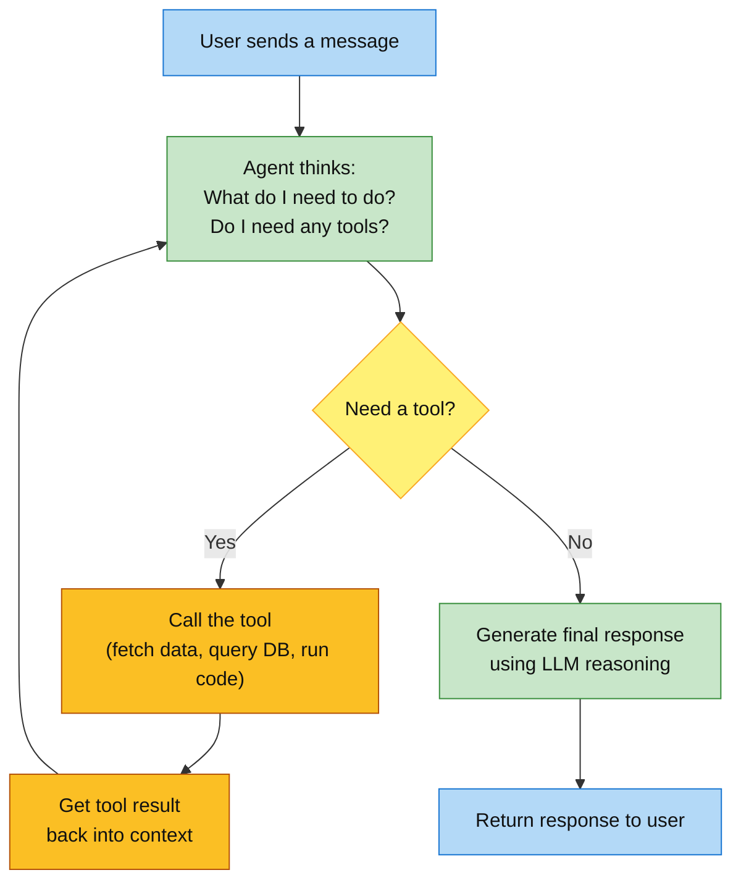

# Building AI Agents with Google ADK & Comet OPIK

**Global Academy of Technology — Engineering Faculty Workshop**

---


## The Real Cost of Doing It Manually


| Task | Manual with AI Assistant | With an AI Agent |
|---|---|---|
| Grade 30 lab reports | 30 separate interactions — paste, wait, paste, wait | All 30 graded simultaneously — time of 1 |
| Generate exam papers for 4 departments | 4 × 2 manual steps (topic → concepts → questions) | One command, all 4 pipelines run automatically |
| Track 10 students across a semester | Re-paste full history every single conversation | Agent remembers everything across all sessions |
| Answer department queries all day | You decide which expert to consult each time | Router agent delegates automatically |
| Improve a weak student report | Paste → read feedback → edit → paste again, repeat | Loop agent iterates until quality threshold met |

---

## Why Is Everyone Moving to AI Agents Now?


| Company | What they are doing |
|---|---|
| **Google** | Released ADK and Vertex AI Agent Builder — making agent development a core product |
| **Microsoft** | Copilot Studio and Azure AI Agent Service — agents embedded across Office 365 |
| **Amazon** | Amazon Q — autonomous agents for software development and business workflows |
| **Salesforce** | Agentforce — AI agents handling customer service, sales, and operations autonomously |

**The pattern is clear:** 2023–2024 was the era of AI assistants. 2025 onwards is the era of AI agents.

The difference is autonomy:
- An **AI assistant** waits for you to ask a question and answers it
- An **AI agent** is given a goal and figures out how to achieve it — using tools, memory, and other agents

---

## What is the Difference? AI Assistant vs AI Agent


> **LLM (Large Language Model)** — the AI brain underneath ChatGPT, Claude, and Gemini. It predicts the next token given a prompt. An AI assistant wraps an LLM in a chat interface — it can remember within a conversation, but it only *responds*. An AI agent wraps an LLM in a program that can also *act* — call tools, chain steps, loop, and take decisions without waiting for you to prompt it each time.

An **AI agent** can:
- **Use tools** — call APIs *(Application Programming Interfaces — ways for programs to talk to each other)*, fetch web pages, query databases, run code
- **Remember** — maintain context across a session (`session_id` is a named conversation thread that carries full history across all turns) or multiple sessions
- **Chain steps** — run a pipeline of tasks automatically with no human in the loop
- **Act in parallel** — process multiple things simultaneously
- **Loop** — repeat a task until a quality condition is met
- **Route** — decide which specialist to delegate a task to

| | AI Assistant (ChatGPT / Claude / Gemini) | AI Agent (ADK) |
|---|---|---|
| **Memory** | Remembers within a session — but only what you explicitly tell it | Remembers full session history automatically, and can persist across sessions |
| **Live data** | Limited to training data by default — requires plugins or extensions for live data | Fetches live data via tools natively |
| **Multi-step tasks** | You manually carry outputs between steps | Pipeline runs end-to-end automatically |
| **Parallel work** | One thing at a time | Multiple tasks simultaneously |
| **Iteration** | You manually paste-edit-paste | Loops automatically until quality met |
| **Transparency** | No audit trail — you cannot inspect intermediate steps or costs | Full trace — every step auditable |

---

## How Does an AI Agent Actually Work?


At its core, every AI agent follows this loop:



The key insight: **the agent loops**. It keeps calling tools and feeding results back into the LLM until it has everything it needs — fundamentally different from a single AI assistant interaction.

---

## Mental Model — How to Think About an Agent

> *"Before we look at the code, here is a simple mental model that will make everything click."*

Think of an AI agent like a **smart employee** you have just hired:

| Concept | Smart Employee | AI Agent |
|---|---|---|
| **Instruction** | Job description — what their role is and what they must not do | System prompt — the agent's identity, scope, and constraints |
| **Tools** | The tools and systems they have access to — email, CRM, database | Python functions — fetch a URL, query a DB, call an API |
| **Memory** | Keeps notes across meetings — remembers what was discussed before | `session_id` — full conversation history carried across turns |
| **Reasoning** | Reads the situation and decides what to do next | LLM — decides which tool to call and what to say |
| **Manager** | Delegates tasks to specialists in the right department | Router agent — reads the request, delegates to the right sub-agent |
| **Auditor** | Keeps a log of every decision made | OPIK — records every step, input, output, and cost |

> **The key difference from a chatbot:** A chatbot is like a colleague who only answers questions. An agent is like a colleague who can also *do things* — fetch data, run pipelines, coordinate with others — and keeps going until the job is done.

---

## Why Not Just Use the Raw API or Other Frameworks?


| Approach | What it is | The real cost |
|---|---|---|
| **Raw API calls** | Call the LLM API directly | 200+ lines of glue code before any real logic |
| **LangChain / LlamaIndex** | Popular libraries with chains, agents, retrievers | Heavy abstractions — fights you when requirements grow |
| **CrewAI / AutoGen** | Role-based multi-agent frameworks | Opaque execution — hard to trace what each agent decided |
| **Build your own** | Custom orchestration on top of the raw API | Weeks of infrastructure before writing any agent logic |
| **Vertex AI Agent Builder** | Google's no-code / low-code drag-and-drop builder | Fast to start, hits a wall quickly; hard to version-control |
| **Google ADK** ✓ | Open-source, **multi-language**, **platform-agnostic** framework | 4 built-in patterns, connects to any tool or service, production-ready |

---

## What is Google ADK?


> **Google Agent Development Kit (ADK)** is an open-source, **multi-language**, **platform-agnostic** framework for building, orchestrating, and deploying AI agents.

- Built by the **Google Gemini team** — Google's own production system
- **Apache 2.0 license** — free forever, no vendor lock-in
- **Multi-language** — official SDKs for **Python** and **Java**, with more on the way
- **Model-agnostic** — Gemini, Ollama (local, free), Claude, GPT, or any LiteLLM-compatible model *(LiteLLM is an open-source library that gives a unified API to 100+ LLMs — swap models with one line)*
- **Platform-agnostic** — local laptop, Cloud Run, Vertex AI, or any container
- **Tool ecosystem** — Function tools, built-in Google tools, OpenAPI specs, or **MCP servers** (open protocol for connecting agents to external services — think of it as npm packages for agent capabilities: GitHub, Slack, databases, file systems and hundreds more)
- Reference: https://adk.dev/get-started/go/

> **Running locally with no API key:** Set `GEMINI_MODEL=ollama/llama3.2` in `.env` and install [Ollama](https://ollama.com) — the agent runs entirely on your laptop, free, with no internet required. Every demo today works with Ollama.

### Why "platform-agnostic" matters

| | What it means |
|---|---|
| **Any language** | Python for data science teams, Java for enterprise backend teams |
| **Any model** | Swap Gemini for Ollama (local, free) with one line in `.env` |
| **Any cloud** | GCP, AWS, Azure, on-premise, or your own laptop |
| **Any tool** | REST APIs, databases, GitHub, Slack — via Function tools or MCP servers |
| **Any deployment** | CLI locally → `adk api_server` for REST → Cloud Run for production |

```python
# An agent is just a code object — no YAML, no magic
from google.adk.agents import LlmAgent

agent = LlmAgent(
    name        = "HelloAgent",
    model       = "gemini-2.0-flash",
    instruction = "You are a helpful assistant for engineering faculty.",
)
```

---

## ADK vs LangChain vs CrewAI


| Criterion | LangChain | CrewAI | **Google ADK** |
|---|---|---|---|
| **Learning curve** | Steep — chains, callbacks, LCEL | Moderate — opaque execution | **Gentle — plain code objects** |
| **Debuggability** | Hard — buried stack traces | Hard — decisions hidden | **Easy — breakpoints, print, unit-test** |
| **Multi-agent patterns** | Manual stitching | Built-in but limited | **4 first-class patterns** |
| **Language support** | Python only | Python only | **Python and Java** |
| **Model support** | Many providers | OpenAI / Azure mainly | **Gemini, Ollama, Claude, GPT** |
| **Tool ecosystem** | LangChain tool hub | Limited | **Function, OpenAPI, Built-in, MCP** |
| **Observability** | LangSmith (paid) | No built-in tracing | **OPIK (free, open source)** |
| **Deployment** | Build your own server | Build your own server | **`adk api_server` — one command** |
| **Backed by** | LangChain Inc. | crewAI startup | **Google / Gemini team** |

---

## What Could You Build at GAT?

Today's demos are designed for engineering faculty — but the patterns apply to any institution. Here are ideas you can take away and build after this workshop:

| Idea | Pattern |
|---|---|
| Auto-grade assignment submissions for your course | `ParallelAgent` |
| Answer student queries and route to the right department | Router |
| Generate lecture notes, quizzes, and assignments from a syllabus | `SequentialAgent` |
| Track student progress across an entire semester | Memory (`session_id`) |
| Fetch live data from university portals and answer questions | Tool use |
| Iteratively improve student project reports until rubric is met | `LoopAgent` |
| Audit every AI decision made in your department | OPIK tracing |

> All of these can be built with the same 6 patterns you will see demonstrated today.

---

## Handover to P2

> *"That covers the big picture — what AI agents are, why the industry is moving to them, and why we chose Google ADK. Now P2 will walk through the 6 agent patterns — the problem each one solves and its architecture diagram. After each pattern, P3 will open the code, run it live, and show you the output. We also have Comet OPIK which makes every agent fully transparent — you will see that introduced after the third pattern."*
